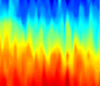
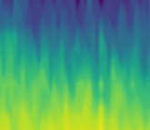

# ReplaceColormap
Given an input image/plot done in one colormap, replace all colors using a different colormap. This can be used to convert plots with terrible colormaps such as "jet" into perceptually uniform colormaps such as "viridis".

## Example

Input plot created using the "jet" colormap:

Output image with the perceptually uniform "viridis" colormap.
